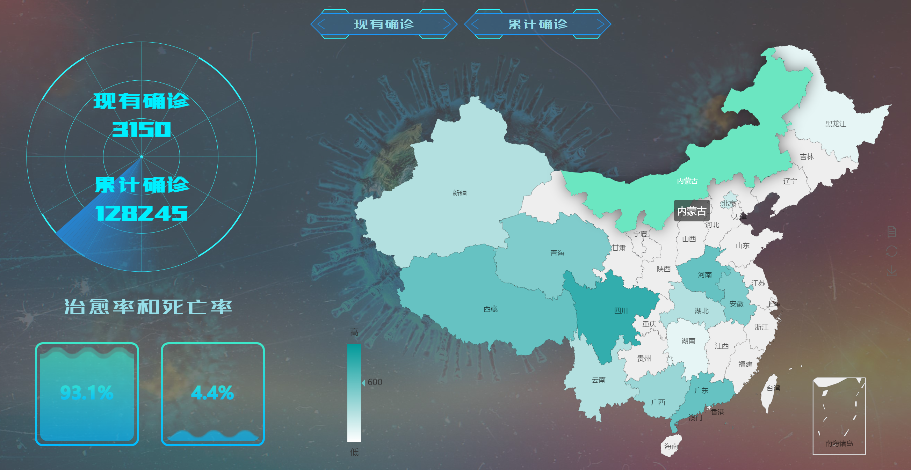
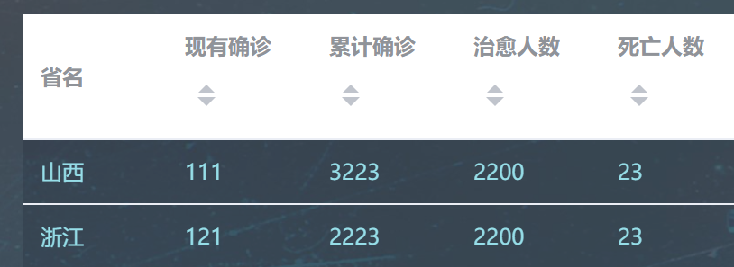
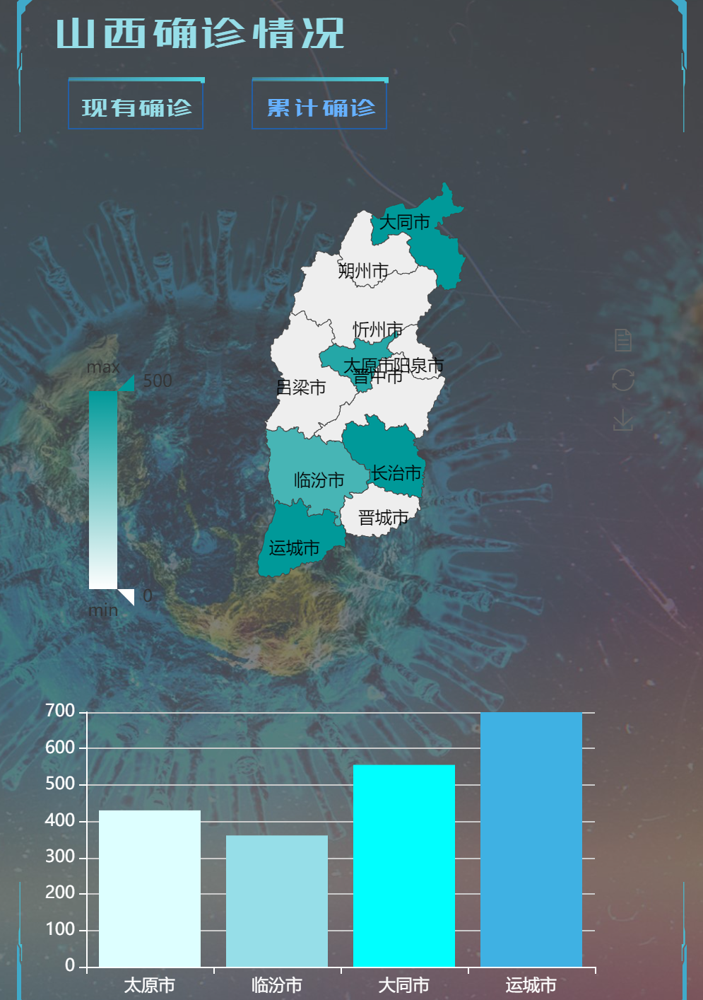

# 中国热力图



## 二、获取每个省现有确诊人数
前端请求参数：

| 参数名     | 类型   | 说明             |
| ---------- | ------ | ---------------- |
| start_time | string | 该组数据开始时间 |
| end_time   | string | 该组数据结束时间 |


后端响应参数：

| 参数名 | 类型   | 说明         |
| ------ | ------ | ------------ |
| name   | String | 省份名称     |
| value  | int    | 现有确诊人数 |


后端返回结果格式：

```json
{
   "data":[
            {name: '北京', value: 20}, 
            {name: '四川', value: 8 },
            {name: ... , value: ... }
		 ]
}	
	
```


## 三、获取每个省累计确诊人数

前端请求参数：

| 参数名     | 类型   | 说明             |
| ---------- | ------ | ---------------- |
| start_time | string | 该组数据开始时间 |
| end_time   | string | 该组数据结束时间 |


后端响应参数：

| 参数名 | 类型   | 说明         |
| ------ | ------ | ------------ |
| name   | String | 省份名称     |
| value  | int    | 累计确诊人数 |


后端返回结果格式：

```json
{
   "data":[
            {name: '北京', value: 20}, 
            {name: '四川', value: 8 },
            {name: ... , value: ... }
		 ]
}	
	
```


# 全国疫情变化折线图


前端请求参数：

| 参数名     | 类型   | 说明             |
| ---------- | ------ | ---------------- |
| start_time | string | 该组数据开始时间 |
| end_time   | string | 该组数据结束时间 |

后端响应参数：

| 参数名       | 类型   | 说明         |
| ------------ | ------ | ------------ |
| name         | String | 省份名称     |
| curConfirmed | String | 现有确诊     |
| curSuspected | String | 现存疑似     |
| totConfirmed | String | 累计确诊     |
| curedCount   | String | 累计治愈人数 |
| deadCount    | String | 累计死亡人数 |

后端返回结果格式：

```json
{
   "data":[
            {
              time: '2021/9/11 17:00:00',
              curConfirmed: '111',
              curSuspected: '21'
              totConfirmed: '3223',
              curedCount: '2200',
              deadCount: '23',
            }, 
       		{
              time: '2021/9/12 17:00:00',
              curConfirmed: '111',
              curSuspected: '21'
              totConfirmed: '3223',
              curedCount: '2200',
              deadCount: '23',
            }, 
       		{
              time: '2021/9/12 17:00:00',
              curConfirmed: '111',
              curSuspected: '21'
              totConfirmed: '3223',
              curedCount: '2200',
              deadCount: '23',
            }, 
		]
}	
	
```


# 省份展示表




## 一、获取全国每个省累计确诊人数

前端请求参数：

| 参数名     | 类型   | 说明             |
| ---------- | ------ | ---------------- |
| start_time | string | 该组数据开始时间 |
| end_time   | string | 该组数据结束时间 |


后端响应参数：

| 参数名       | 类型   | 说明         |
| ------------ | ------ | ------------ |
| name         | String | 省份名称     |
| curConfirmed | String | 现有确诊     |
| totConfirmed | String | 累计确诊     |
| curedCount   | String | 累计治愈人数 |
| deadCount    | String | 累计死亡人数 |
| curedPercent | String | 治愈率       |
| deadPercent  | String | 死亡率       |


后端返回结果格式：

```json
{
   "data":[
            {
              name: '山西',
              curConfirmed: '111',
              totConfirmed: '3223',
              curedCount: '2200',
              deadCount: '23',
              curedPercent: '98%',
              deadPercent: '2%',
            }, {
              name: '浙江',
              curConfirmed: '121',
              totConfirmed: '2223',
              curedCount: '2200',
              deadCount: '23',
              curedPercent: '98%',
              deadPercent: '2%',
            }, 
		]
}	
	
```

补充说明：即为H列每个省province_confirmedCount，取updateTime最新的一条数据


# 每个省热力图




## 二、获取每个省现有确诊人数

前端请求参数：

| 参数名      | 类型   | 说明             |
| ----------- | ------ | ---------------- |
| provin_name | string | 省份名称         |
| start_time  | string | 该组数据开始时间 |
| end_time    | string | 该组数据结束时间 |


后端响应参数：

| 参数名 | 类型   | 说明         |
| ------ | ------ | ------------ |
| name   | String | 城市名称     |
| value  | int    | 现有确诊人数 |


后端返回结果格式：

```json
{
   "data":[
            {name: '太原', value: 20}, 
            {name: '大同', value: 8 },
            {name: ... , value: ... }
		 ]
}	
	
```

## 三、获取每个省累计确诊人数

前端请求参数：

| 参数名      | 类型   | 说明             |
| ----------- | ------ | ---------------- |
| provin_name | string | 省份名称         |
| start_time  | string | 该组数据开始时间 |
| end_time    | string | 该组数据结束时间 |


后端响应参数：

| 参数名 | 类型   | 说明         |
| ------ | ------ | ------------ |
| name   | String | 省份名称     |
| value  | int    | 累计确诊人数 |


后端返回结果格式：

```json
{
   "data":[
            {name: '太原', value: 270}, 
            {name: '打通', value: 854 },
            {name: ... , value: ... }
		 ]
}	
	
```

